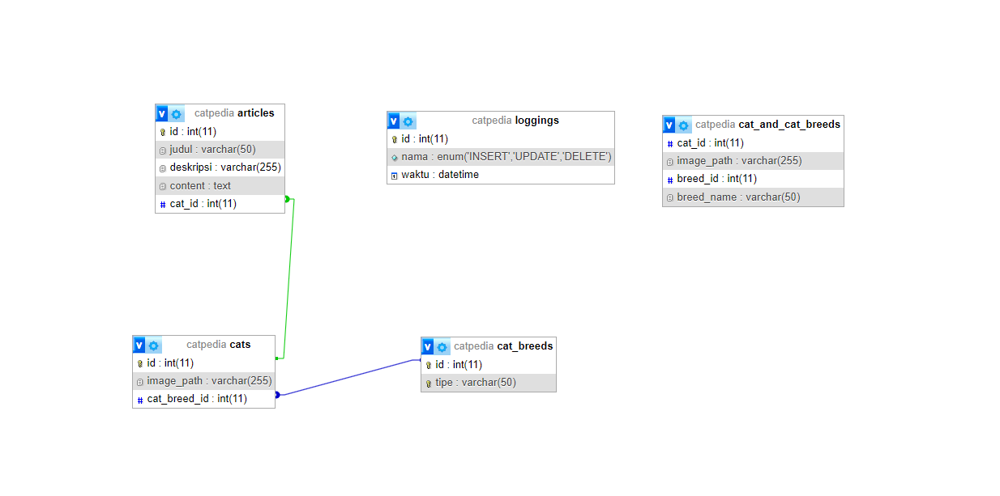

# 🐱 Proyek Database Catpedia

## 📘 Deskripsi Proyek

**Catpedia** adalah proyek basis data yang dirancang untuk mengelola informasi mengenai kucing, jenis (breed) kucing, serta artikel terkait. Proyek ini mencakup tahapan perancangan, scripting SQL menggunakan DDL, DML, DCL, hingga implementasi fitur lanjutan seperti _stored procedure_, _function_, _trigger_, dan _view_.

---

## 🧩 1. Perancangan Database

### a. Entitas Utama

Terdapat tiga entitas utama dalam database **Catpedia**:

1. **cats** – menyimpan informasi dasar tentang kucing.
2. **cat_breeds** – menyimpan daftar ras atau jenis kucing.
3. **articles** – menyimpan artikel yang terkait dengan kucing.

### b. Relasi Antar Tabel

- Satu `cat_breed` dapat memiliki banyak `cats` (**one-to-many**).
- Satu `cat` dapat memiliki banyak `articles` (**one-to-many**).
- Jika `cat_breed` dihapus → semua `cats` terkait akan ikut dihapus (`ON DELETE CASCADE`).
- Jika `cat` dihapus → kolom `cat_id` di `articles` akan diset ke `NULL` (`ON DELETE SET NULL`).

### c. Diagram Relasi Tabel (ERD)



### d. Tipe Data yang Digunakan

- `INT` → digunakan untuk ID unik dan relasi antar tabel.
- `VARCHAR` → digunakan untuk menyimpan teks pendek seperti nama dan deskripsi.
- `TEXT` → untuk teks panjang seperti konten artikel.
- `ENUM` → digunakan pada tabel `loggings` untuk jenis aksi (`INSERT`, `UPDATE`, `DELETE`).
- `DATETIME` → menyimpan waktu otomatis dengan `DEFAULT NOW()`.

---

## ⚙️ 2. Scripting dengan DDL (Data Definition Language)

```sql
CREATE DATABASE catpedia;

USE catpedia;

CREATE TABLE cats (
    id INT PRIMARY KEY AUTO_INCREMENT,
    nama VARCHAR(100) NOT NULL UNIQUE,
    image_path VARCHAR(255)
);

CREATE TABLE cat_types (
    id INT PRIMARY KEY AUTO_INCREMENT,
    tipe VARCHAR(50) NOT NULL UNIQUE
);

CREATE TABLE articles (
    id INT PRIMARY KEY AUTO_INCREMENT,
    judul VARCHAR(50) NOT NULL,
    deskripsi VARCHAR(255) NOT NULL,
    content TEXT NOT NULL
);

ALTER TABLE cats DROP COLUMN nama;

RENAME TABLE cat_types TO cat_breed;
RENAME TABLE cat_breed TO cat_breeds;

ALTER TABLE cats
ADD COLUMN cat_breed_id INT NULL,
ADD CONSTRAINT cats_to_cat_breeds
FOREIGN KEY (cat_breed_id) REFERENCES cat_breeds(id) ON DELETE CASCADE;

ALTER TABLE articles
ADD COLUMN cat_id INT NULL,
ADD CONSTRAINT articles_to_cat
FOREIGN KEY (cat_id) REFERENCES cats(id) ON DELETE SET NULL;

CREATE TABLE testing (
    id INT PRIMARY KEY AUTO_INCREMENT,
    nama VARCHAR(255)
);

INSERT INTO testing(nama) VALUES ("Alex"), ("Udin"), ("Alexander"), ("Ucok");

RENAME TABLE testing TO not_testing;
TRUNCATE TABLE not_testing;
DROP TABLE not_testing;
```

---

## 🧮 3. Scripting dengan DML (Data Manipulation Language)

```sql
INSERT INTO cat_breeds(tipe) VALUES ("Persian"), ("Maine Coon"), ("Russian Blue");

INSERT INTO cat_breeds(tipe)
VALUES ("Persian"), ("Korat"), ("Devon Rex");

INSERT INTO cats(cat_breed_id) VALUES (2), (3), (4), (5);

UPDATE cat_breeds SET tipe = "Bombay Cat" WHERE id = 1;

DELETE FROM cat_breeds WHERE id = 1;

SELECT * FROM cat_breeds WHERE id = 2;
SELECT * FROM cat_breeds ORDER BY id ASC;
SELECT * FROM cat_breeds ORDER BY id DESC;
SELECT * FROM cat_breeds LIMIT 4;
SELECT * FROM cat_breeds ORDER BY id ASC LIMIT 3;
```

---

## 🔐 4. Scripting dengan DCL (Data Control Language)

```sql
CREATE USER 'zaidan'@'localhost' IDENTIFIED BY 'password';
GRANT ALL PRIVILEGES ON cats TO 'zaidan'@'localhost';
GRANT SELECT ON cat_breeds TO 'zaidan'@'localhost';

CREATE USER 'author_zaidan'@'localhost' IDENTIFIED BY 'author_zaidan123';
GRANT SELECT ON articles TO 'author_zaidan'@'localhost';
```

---

## 🧠 5. Advanced SQL (Optional Challenge)

### a. Query JOIN

```sql
SELECT * FROM cats
INNER JOIN cat_breeds ON cats.cat_breed_id = cat_breeds.id;
```

### b. Stored Procedure

```sql
CREATE PROCEDURE collect_all_cat_data(IN id_cat INT)
BEGIN
    SELECT cat_breeds.tipe AS ras_kucing, cats.id AS cat_id
    FROM cats
    INNER JOIN cat_breeds ON id_cat = cat_breeds.id;
END;

CALL collect_all_cat_data(2);
```

### c. Stored Function

```sql
CREATE FUNCTION count_all_cats()
RETURNS INT
DETERMINISTIC
BEGIN
    DECLARE total_cats INT;
    SELECT COUNT(*) INTO total_cats FROM cats;
    RETURN total_cats;
END;

SELECT count_all_cats();
```

### d. Trigger

```sql
CREATE TABLE loggings(
    id INT AUTO_INCREMENT PRIMARY KEY,
    nama ENUM("INSERT", "UPDATE", "DELETE"),
    waktu DATETIME DEFAULT NOW()
);

CREATE TRIGGER after_insert
AFTER INSERT ON cats
FOR EACH ROW
BEGIN
    INSERT INTO loggings(nama, waktu) VALUES ("INSERT", NOW());
END;

INSERT INTO cats(cat_breed_id) VALUES (2);
```

### e. View

```sql
CREATE VIEW cat_and_cat_breeds AS
SELECT
    cats.id AS cat_id,
    cats.image_path,
    cat_breeds.id AS breed_id,
    cat_breeds.tipe AS breed_name
FROM cats
LEFT JOIN cat_breeds ON cats.cat_breed_id = cat_breeds.id;

SELECT * FROM cat_and_cat_breeds;
```

📅 **Disusun oleh:** _Muhammad Zaidan Fathan Abdullah_  
🏷️ **Tanggal:** _Kamis 23 Oktober 2025_
